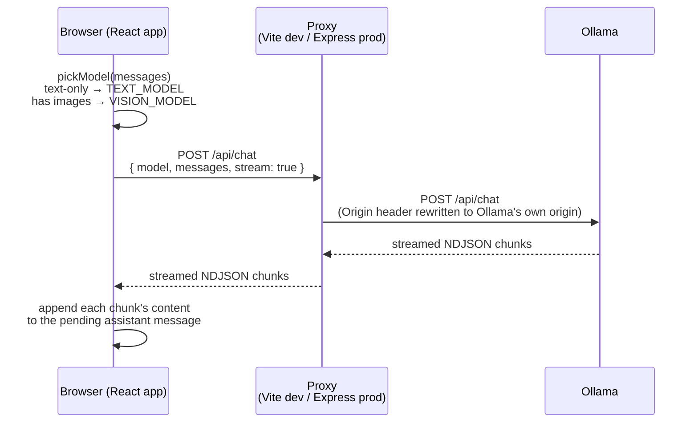
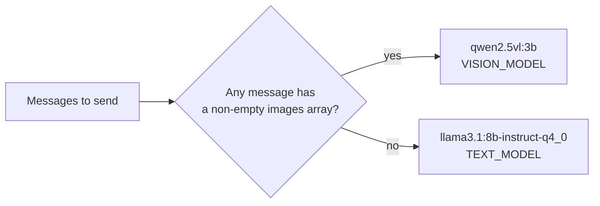
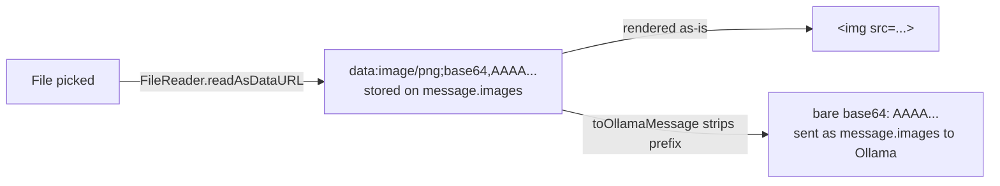
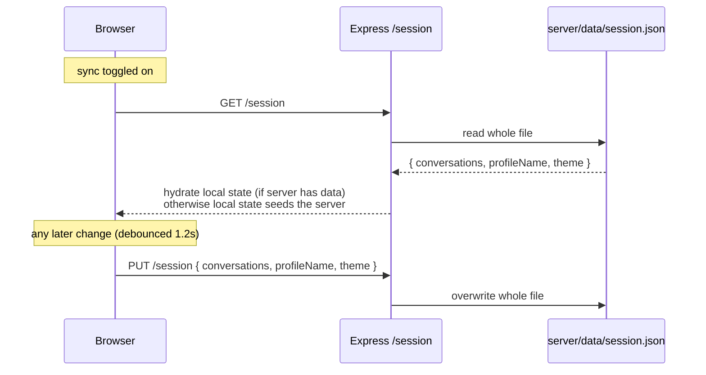
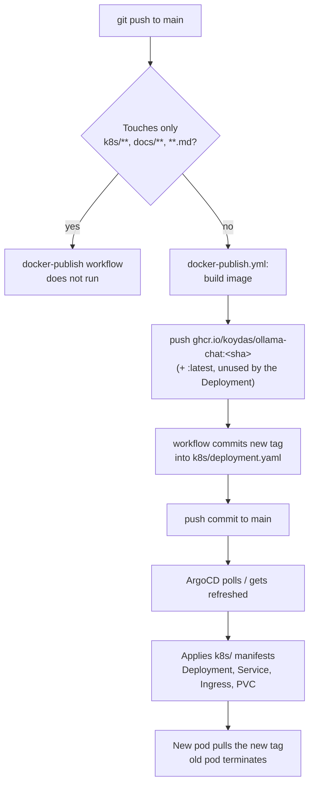
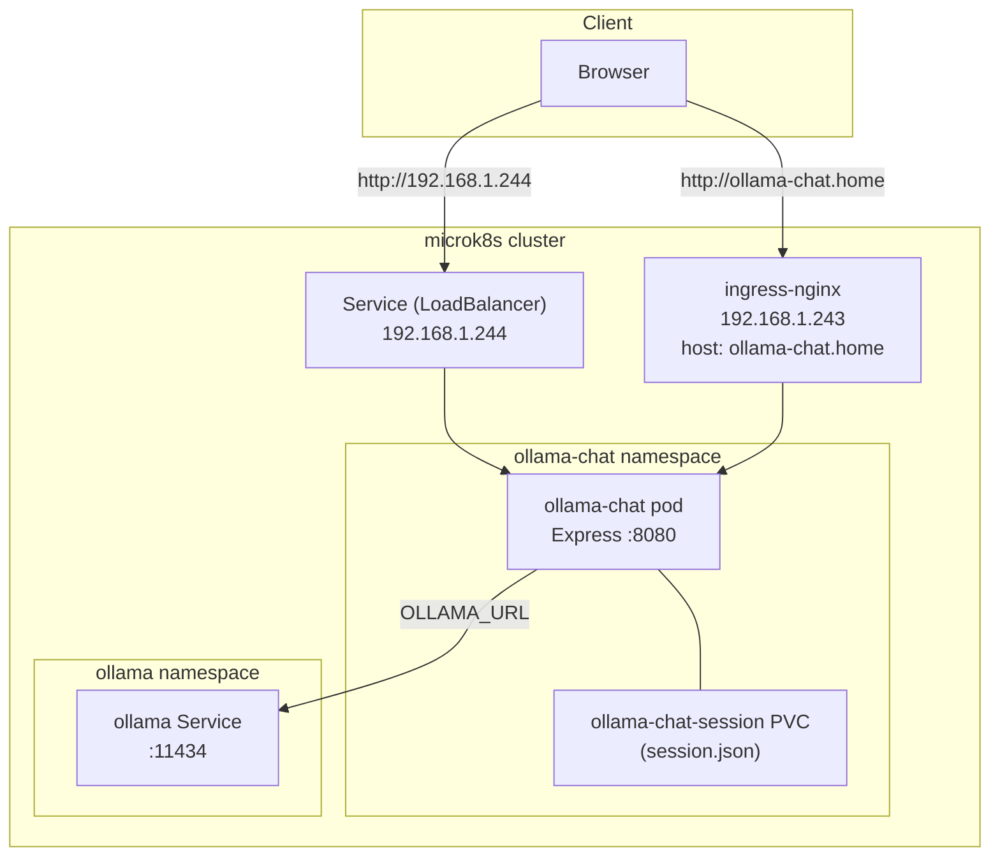

# Architecture

`ollama-chat` is a single-page React app talking directly to an Ollama server, plus a small
Express process that does two unrelated jobs: proxying chat requests in production, and
persisting an opt-in session-sync blob. There is deliberately no "chat backend" — the browser
streams tokens straight from Ollama in both dev and prod. See [`docs/adr/`](./adr/README.md)
for the reasoning behind each of these choices.

## Components

| Component | Role | Source |
|---|---|---|
| React/Vite frontend | Conversation UI, message streaming, image attachments, theme/profile | `src/App.jsx`, `src/lib/conversations.js` |
| Vite dev proxy | Dev-only: forwards `/api/*` to Ollama, `/session` to the local Express server | `vite.config.js` |
| Express server | Prod: serves `dist/`, proxies `/api/*` to Ollama, persists `/session` | `server/index.js` |
| Ollama | Runs the actual models; two tags are used: a text model and a vision model | in-cluster `ollama` Service |
| ArgoCD + GHCR | Builds, publishes, and deploys the app on every push to `main` | `.github/workflows/docker-publish.yml`, `k8s/` |

## Request flow: sending a chat message

There is no application logic between the browser and Ollama for chat itself — the Express
server (or Vite in dev) is a pure reverse proxy that streams bytes through untouched.

Two details make this work:

- **Origin rewriting** — Ollama enforces an Origin allowlist (DNS-rebinding protection). Both
  proxies overwrite the `Origin` header to Ollama's own origin before forwarding, since the
  browser's real page origin would otherwise be rejected ([ADR-0005](./adr/0005-direct-vite-proxy-to-ollama.md)).
- **Model routing** — the model is decided client-side, per request, by `pickModel()`:
  whichever message array is about to be sent is scanned for a non-empty `images` field.

There is no model picker in the UI ([ADR-0009](./adr/0009-fixed-chat-mode-automatic-model-routing.md)) —
this decision is the only "model selection" that happens anywhere in the app.

## Image attachments

Images are read client-side into full data URLs (`data:image/...;base64,...`) so they can be
rendered directly in `` tags and stored alongside conversation history. Ollama, however,
expects bare base64 with no prefix — that conversion happens in exactly one place,
`toOllamaMessage()`, right before a request is sent ([ADR-0008](./adr/0008-image-attachments-as-data-urls.md)).

## Storage and sync

Conversations, profile name, and theme live in `localStorage` and work fully offline with no
backend running. Enabling "Sauvegarder sur le serveur" opts into syncing that same data to a
single JSON blob on the Express server, debounced by 1.2s ([ADR-0001](./adr/0001-local-first-storage-with-opt-in-sync.md),
[ADR-0002](./adr/0002-file-based-json-session-store.md)).

There's a single implicit profile with no authentication ([ADR-0003](./adr/0003-no-authentication-single-implicit-profile.md)) —
this is a trusted-network, single-user tool, not a multi-tenant service.

## Deployment pipeline

The workflow's own commit only touches `k8s/deployment.yaml`, which is in its own
`paths-ignore`, so it doesn't re-trigger itself ([ADR-0006](./adr/0006-gitops-deployment-via-ghcr.md)).
ArgoCD's `automated: { prune: true, selfHeal: true }` policy is what turns that commit into a
live rollout — no image-updater controller involved.

## Runtime topology (production)

Reachable either via a dedicated MetalLB IP (`.244`, zero client-side setup) or through the
shared ingress at `ollama-chat.home` (`.243`, needs a `/etc/hosts` entry) — see
[ADR-0007](./adr/0007-dedicated-metallb-ip.md).
