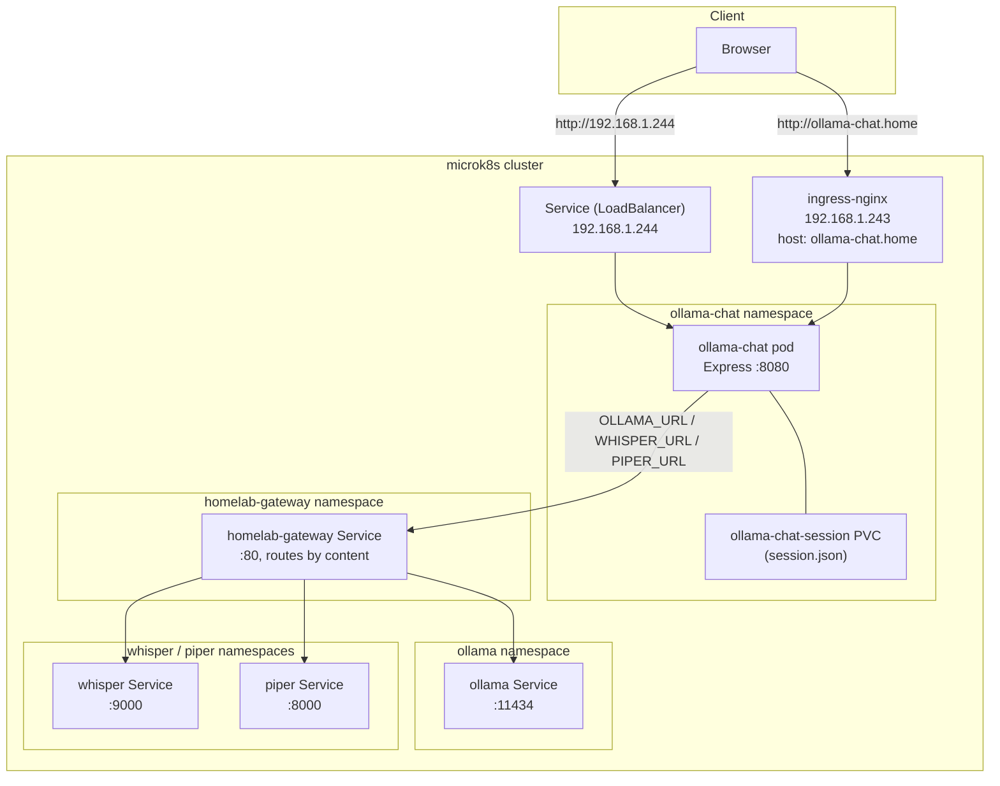

# Architecture

`ollama-chat` is a single-page React app talking directly to an Ollama server, plus a small
Express process that does two unrelated jobs: proxying chat requests in production, and
persisting an opt-in session-sync blob. There is deliberately no "chat backend" — the browser
streams tokens straight from Ollama in both dev and prod. See [`docs/adr/`](./adr/README.md)
for the reasoning behind each of these choices.

This page is the map: a component overview and the production runtime topology. Each
subsystem has its own focused page:

- [`chat-and-images.md`](./chat-and-images.md) — sending a message, automatic model routing, image attachments
- [`vocal-mode.md`](./vocal-mode.md) — dictation, TTS playback, the mic/send button state machine
- [`storage-sync.md`](./storage-sync.md) — local-first storage, opt-in server-side sync
- [`deployment.md`](./deployment.md) — CI/CD pipeline, bootstrapping a new server's TLS cert

## Components

| Component | Role | Source |
|---|---|---|
| React/Vite frontend | Conversation UI, message streaming, image attachments, theme/profile | `src/App.jsx`, `src/lib/conversations.js` |
| Vite dev proxy | Dev-only: forwards `/api/*` to Ollama, `/session` to the local Express server | `vite.config.js` |
| Express server | Prod: serves `dist/`, proxies `/api/*` to Ollama, persists `/session` | `server/index.js` |
| homelab-gateway | Single entry point in front of Ollama/Whisper/Piper; routes by request content and exports Prometheus metrics for all three ([ADR-0014](./adr/0014-route-production-traffic-through-homelab-gateway.md)) | `github.com/koydas/homelab-gateway`, in-cluster `homelab-gateway` Service |
| Ollama | Runs the actual models; two tags are used: a text model and a vision model | in-cluster `ollama` Service, reached via homelab-gateway |
| Whisper | Speech-to-text for vocal mode dictation, proxied at `/api/stt` | in-cluster `whisper` Service, reached via homelab-gateway |
| Piper | Text-to-speech for vocal mode replies, proxied at `/api/tts` | in-cluster `piper` Service, reached via homelab-gateway |
| ArgoCD + GHCR | Builds, publishes, and deploys the app on every push to `main` | `.github/workflows/docker-publish.yml`, `k8s/` |

## Runtime topology (production)

Reachable either via a dedicated MetalLB IP (`.244`, zero client-side setup) or through the
shared ingress at `ollama-chat.home` (`.243`, needs a `/etc/hosts` entry) — see
[ADR-0007](./adr/0007-dedicated-metallb-ip.md).
