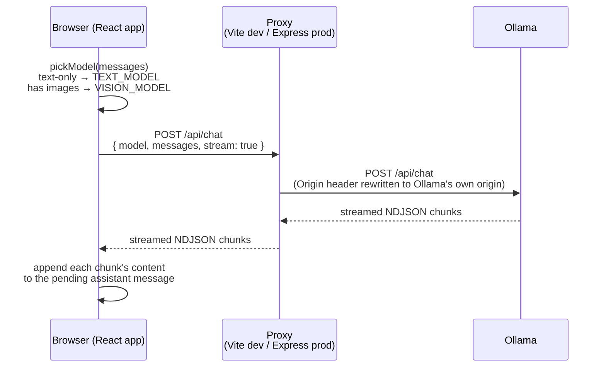
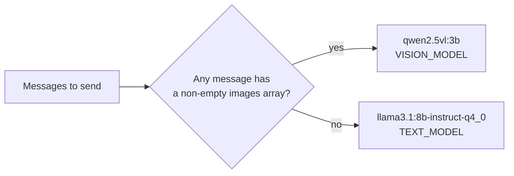
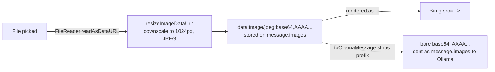
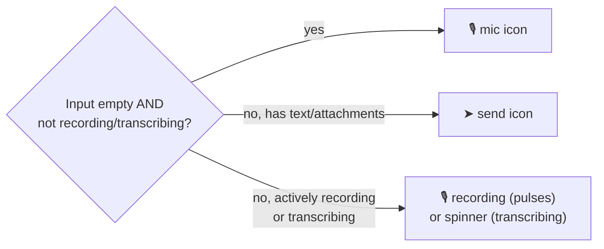
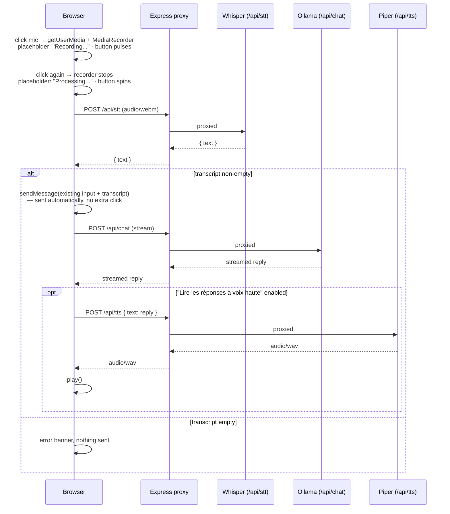
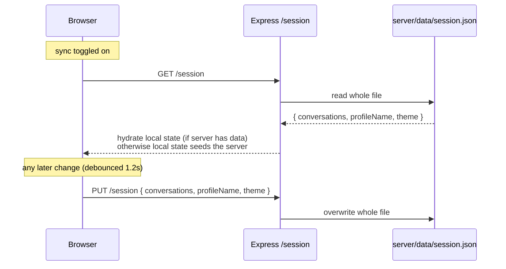
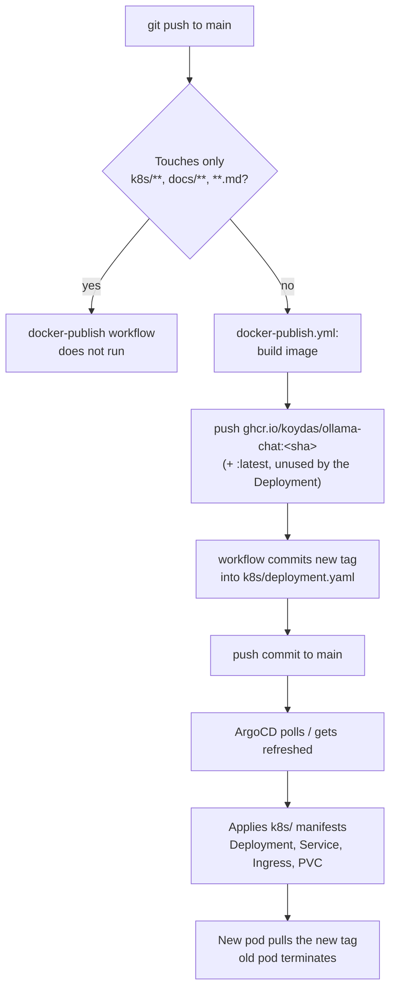
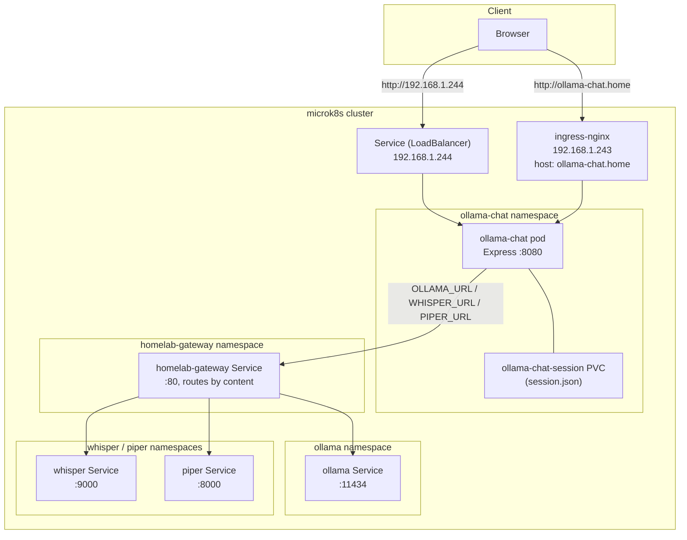

# Architecture

`ollama-chat` is a single-page React app talking directly to an Ollama server, plus a small
Express process that does two unrelated jobs: proxying chat requests in production, and
persisting an opt-in session-sync blob. There is deliberately no "chat backend" — the browser
streams tokens straight from Ollama in both dev and prod. See [`docs/adr/`](./adr/README.md)
for the reasoning behind each of these choices.

## Components

| Component | Role | Source |
|---|---|---|
| React/Vite frontend | Conversation UI, message streaming, image attachments, theme/profile | `src/App.jsx`, `src/lib/conversations.js` |
| Vite dev proxy | Dev-only: forwards `/api/*` to Ollama, `/session` to the local Express server | `vite.config.js` |
| Express server | Prod: serves `dist/`, proxies `/api/*` to Ollama, persists `/session` | `server/index.js` |
| homelab-gateway | Single entry point in front of Ollama/Whisper/Piper; routes by request content and exports Prometheus metrics for all three ([ADR-0014](./adr/0014-route-production-traffic-through-homelab-gateway.md)) | `github.com/koydas/homelab-gateway`, in-cluster `homelab-gateway` Service |
| Ollama | Runs the actual models; two tags are used: a text model and a vision model | in-cluster `ollama` Service, reached via homelab-gateway |
| Whisper | Speech-to-text for vocal mode dictation, proxied at `/api/stt` | in-cluster `whisper` Service, reached via homelab-gateway |
| Piper | Text-to-speech for vocal mode replies, proxied at `/api/tts` | in-cluster `piper` Service, reached via homelab-gateway |
| ArgoCD + GHCR | Builds, publishes, and deploys the app on every push to `main` | `.github/workflows/docker-publish.yml`, `k8s/` |

## Request flow: sending a chat message

There is no application logic between the browser and Ollama for chat itself — the Express
server (or Vite in dev) is a pure reverse proxy that streams bytes through untouched.



In production, `P`'s hop to `O` actually passes through `homelab-gateway` first
([ADR-0014](./adr/0014-route-production-traffic-through-homelab-gateway.md)), which does its
own Origin rewrite before forwarding to Ollama — simplified out of this diagram since the
gateway is a transparent pass-through for this flow.

Two details make this work:

- **Origin rewriting** — Ollama enforces an Origin allowlist (DNS-rebinding protection). Both
  proxies overwrite the `Origin` header to Ollama's own origin before forwarding, since the
  browser's real page origin would otherwise be rejected ([ADR-0005](./adr/0005-direct-vite-proxy-to-ollama.md)).
- **Model routing** — the model is decided client-side, per request, by `pickModel()`:
  whichever message array is about to be sent is scanned for a non-empty `images` field.



There is no model picker in the UI ([ADR-0009](./adr/0009-fixed-chat-mode-automatic-model-routing.md)) —
this decision is the only "model selection" that happens anywhere in the app.

## Image attachments

Images are read client-side into full data URLs (`data:image/...;base64,...`) so they can be
rendered directly in `` tags and stored alongside conversation history. Before that,
`resizeImageDataUrl()` downscales anything over 1024px on the long edge and re-encodes as
JPEG (falling back to the original on any decode failure/timeout) — full-resolution photos
both overflow the vision model's context window and risk stalling/crashing the tab's
`localStorage` write ([ADR-0015](./adr/0015-resize-images-before-storing.md)). Ollama, however,
expects bare base64 with no prefix — that conversion happens in exactly one place,
`toOllamaMessage()`, right before a request is sent ([ADR-0008](./adr/0008-image-attachments-as-data-urls.md)).



## Vocal mode

A header `<select>` switches `voiceMode` between `text` and `vocal` (persisted in
`localStorage`). In `vocal` mode the input's send-button slot doubles as the mic button
([ADR-0011](./adr/0011-server-side-stt-tts-whisper-piper.md) for why STT/TTS run server-side
via Whisper/Piper rather than the browser's Web Speech API,
[ADR-0012](./adr/0012-self-signed-tls-for-secure-context.md) for why both access paths need
TLS just for `getUserMedia` to be exposed at all):



Recording/transcribing always wins the icon slot even if text appears in the input meanwhile
(e.g. the user typed something before or during dictation) — otherwise the only control that
can stop an in-progress recording would disappear mid-flow.



All three `P->>{W,O,Pi}` hops actually go through `homelab-gateway` in production
([ADR-0014](./adr/0014-route-production-traffic-through-homelab-gateway.md)), which sniffs
each request's content-type/body shape to pick the right backend — simplified out of this
diagram for the same reason as the chat flow above.

A few details that aren't obvious from the code alone:

- **Auto-send, not auto-fill** — dictation used to just populate the input and leave sending
  to the user; it now calls the same `sendMessage()` the Send button uses, combining any text
  already typed with the new transcript. `sendMessage()` was factored out of `handleSend()`
  specifically so both entry points share one path.
- **No silent failures** — an empty Whisper transcript, a `/api/stt` or `/api/tts` error, and
  the (now fixed) audio-unlock issue below all used to fail invisibly at some point during
  development; each now surfaces as an error banner rather than doing nothing.
- **Per-message 🔊 button** — independent of vocal mode, replays any message's text through
  the same `/api/tts` proxy on demand, via a shared `speakText()` helper also used by the
  auto-play path.
- **"Lire les réponses à voix haute" setting** (`autoReadReplies`, on by default, in the
  profile menu) — gates only the *automatic* playback after a reply finishes streaming in
  vocal mode; the manual 🔊 button always works regardless of this setting.
- **Audio unlock** ([ADR-0013](./adr/0013-audio-unlock-for-autoplay-policy.md)) — the gap
  between the click that starts a send/dictation and the eventual `audio.play()` call (after
  the STT/chat/TTS round-trip) is long enough that browsers' autoplay policy rejects
  playback outright unless the shared `<audio>` element was primed with a silent clip
  synchronously inside the click handler first.

## Storage and sync

Conversations, profile name, and theme live in `localStorage` and work fully offline with no
backend running. Enabling "Sauvegarder sur le serveur" opts into syncing that same data to a
single JSON blob on the Express server, debounced by 1.2s ([ADR-0001](./adr/0001-local-first-storage-with-opt-in-sync.md),
[ADR-0002](./adr/0002-file-based-json-session-store.md)).



There's a single implicit profile with no authentication ([ADR-0003](./adr/0003-no-authentication-single-implicit-profile.md)) —
this is a trusted-network, single-user tool, not a multi-tenant service.

## Deployment pipeline



The workflow's own commit only touches `k8s/deployment.yaml`, which is in its own
`paths-ignore`, so it doesn't re-trigger itself ([ADR-0006](./adr/0006-gitops-deployment-via-ghcr.md)).
ArgoCD's `automated: { prune: true, selfHeal: true }` policy is what turns that commit into a
live rollout — no image-updater controller involved.

## Runtime topology (production)



Reachable either via a dedicated MetalLB IP (`.244`, zero client-side setup) or through the
shared ingress at `ollama-chat.home` (`.243`, needs a `/etc/hosts` entry) — see
[ADR-0007](./adr/0007-dedicated-metallb-ip.md).

## Bootstrapping a new server: the TLS Secret and `/etc/hosts` entry

Both access paths depend on `k8s/deployment.yaml` and `k8s/ingress.yaml` mounting/referencing
a `ollama-chat-tls` Secret that is **created out-of-band, once, directly in the cluster** —
it is never committed to Git ([ADR-0012](./adr/0012-self-signed-tls-for-secure-context.md)).
On a brand-new server this Secret doesn't exist yet and must be created by hand before the
Deployment's pod will come up healthy (the `tls-certs` volume mount has nothing to mount
otherwise):

```sh
# 1. Generate a 10-year self-signed cert covering both access paths
openssl req -x509 -nodes -newkey rsa:2048 -days 3650 \
  -keyout tls.key -out tls.crt \
  -subj "/CN=ollama-chat.home" \
  -addext "subjectAltName=DNS:ollama-chat.home,IP:192.168.1.244"

# 2. Create the namespace if it doesn't exist yet
sudo microk8s kubectl create namespace ollama-chat --dry-run=client -o yaml \
  | sudo microk8s kubectl apply -f -

# 3. Create the Secret from the generated cert/key
sudo microk8s kubectl create secret tls ollama-chat-tls \
  --cert=tls.crt --key=tls.key \
  -n ollama-chat

# 4. Don't leave the private key on disk afterwards
rm tls.key tls.crt
```

Re-run steps 1 and 3 (with `kubectl create secret tls ... --dry-run=client -o yaml | kubectl
apply -f -`, or delete-then-recreate) if the Secret is ever lost — there is no backup or
automation for it, by design (ADR-0012).

The `ollama-chat.home` path additionally needs a per-device DNS override, since there's no LAN
DNS server resolving it (ADR-0007). Add this line to `/etc/hosts` on every device that should
reach it by hostname instead of the bare MetalLB IP:

```
192.168.1.243 ollama-chat.home
```

`192.168.1.243` is `ingress-nginx`'s address, not `ollama-chat`'s own MetalLB IP (`.244`) —
the Ingress is what actually matches the `Host: ollama-chat.home` header and routes to the
pod. The `192.168.1.244` path needs no `/etc/hosts` entry at all, by design
([ADR-0007](./adr/0007-dedicated-metallb-ip.md)).
