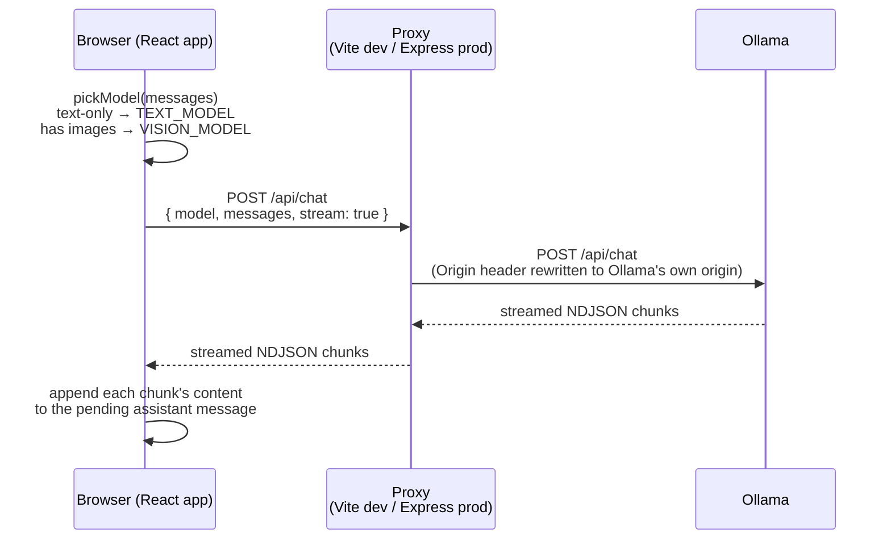
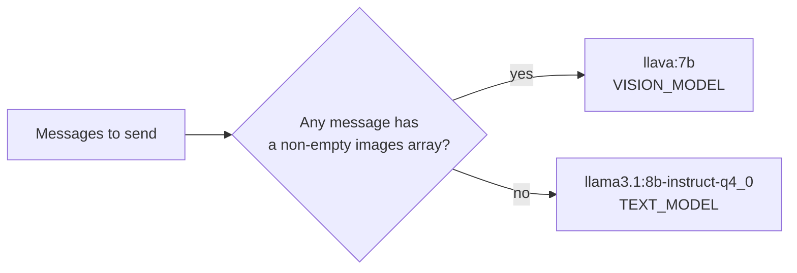
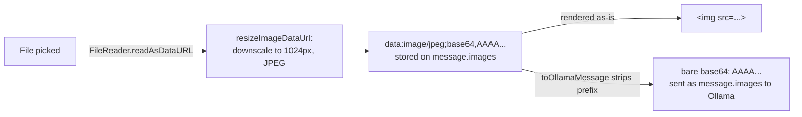

# Chat and image attachments

## Request flow: sending a chat message

There is no application logic between the browser and Ollama for chat itself — the Express
server (or Vite in dev) is a pure reverse proxy that streams bytes through untouched.

In production, `P`'s hop to `O` actually passes through `homelab-gateway` first
([ADR-0014](./adr/0014-route-production-traffic-through-homelab-gateway.md)), which does its
own Origin rewrite before forwarding to Ollama — simplified out of this diagram since the
gateway is a transparent pass-through for this flow.

Two details make this work:

- **Origin rewriting** — Ollama enforces an Origin allowlist (DNS-rebinding protection). Both
  proxies overwrite the `Origin` header to Ollama's own origin before forwarding, since the
  browser's real page origin would otherwise be rejected ([ADR-0005](./adr/0005-direct-vite-proxy-to-ollama.md)).
  Regression-tested in `server/index.e2e.test.js` ([ADR-0017](./adr/0017-e2e-tests-for-the-express-proxy-server.md)).
- **Model routing** — the model is decided client-side, per request, by `pickModel()`:
  whichever message array is about to be sent is scanned for a non-empty `images` field.

There is no model picker in the UI ([ADR-0009](./adr/0009-fixed-chat-mode-automatic-model-routing.md)) —
this decision is the only "model selection" that happens anywhere in the app.

## Image attachments

Images are read client-side into full data URLs (`data:image/...;base64,...`) so they can be
rendered directly in `` tags and stored alongside conversation history. Before that,
`resizeImageDataUrl()` downscales anything over 1024px on the long edge and re-encodes as
JPEG (falling back to the original on any decode failure/timeout) — full-resolution photos
both overflow the vision model's context window and risk stalling/crashing the tab's
`localStorage` write ([ADR-0015](./adr/0015-resize-images-before-storing.md)). Ollama, however,
expects bare base64 with no prefix — that conversion happens in exactly one place,
`toOllamaMessage()`, right before a request is sent ([ADR-0008](./adr/0008-image-attachments-as-data-urls.md)).

