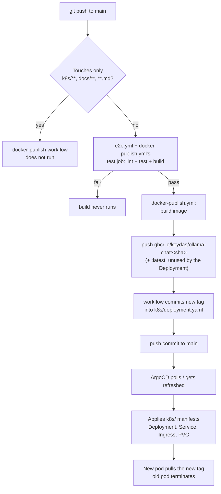

# Deployment

## Pipeline



The workflow's own commit only touches `k8s/deployment.yaml`, which is in its own
`paths-ignore`, so it doesn't re-trigger itself ([ADR-0006](./adr/0006-gitops-deployment-via-ghcr.md)).
ArgoCD's `automated: { prune: true, selfHeal: true }` policy is what turns that commit into a
live rollout — no image-updater controller involved. `npm test` (unit + React integration +
the server e2e suite, see [`storage-sync.md`](./storage-sync.md) and
[`chat-and-images.md`](./chat-and-images.md) for what it covers) gates the build entirely as
of [ADR-0017](./adr/0017-e2e-tests-for-the-express-proxy-server.md) — before that, every push
went straight to building and shipping an image regardless of whether tests would have failed.

**Expect a rejected push** if `docker-publish.yml`'s tag-rewrite commit lands between your
last `git fetch` and your `git push` — this is normal, not a conflict with someone else's
work. Resolve with `git fetch && git pull --rebase origin main && git push origin main`. See
the `homelab-deploy` skill for the full recipe, including forcing an immediate ArgoCD sync
instead of waiting for its ~3 minute poll.

For the production runtime topology (namespaces, Services, how requests reach this pod), see
[`architecture.md`](./architecture.md#runtime-topology-production).

## Bootstrapping a new server: the TLS Secret and `/etc/hosts` entry

Both access paths depend on `k8s/deployment.yaml` and `k8s/ingress.yaml` mounting/referencing
a `ollama-chat-tls` Secret that is **created out-of-band, once, directly in the cluster** —
it is never committed to Git ([ADR-0012](./adr/0012-self-signed-tls-for-secure-context.md)).
On a brand-new server this Secret doesn't exist yet and must be created by hand before the
Deployment's pod will come up healthy (the `tls-certs` volume mount has nothing to mount
otherwise):

```sh
# 1. Generate a 10-year self-signed cert covering both access paths
openssl req -x509 -nodes -newkey rsa:2048 -days 3650 \
  -keyout tls.key -out tls.crt \
  -subj "/CN=ollama-chat.home" \
  -addext "subjectAltName=DNS:ollama-chat.home,IP:192.168.1.244"

# 2. Create the namespace if it doesn't exist yet
sudo microk8s kubectl create namespace ollama-chat --dry-run=client -o yaml \
  | sudo microk8s kubectl apply -f -

# 3. Create the Secret from the generated cert/key
sudo microk8s kubectl create secret tls ollama-chat-tls \
  --cert=tls.crt --key=tls.key \
  -n ollama-chat

# 4. Don't leave the private key on disk afterwards
rm tls.key tls.crt
```

Re-run steps 1 and 3 (with `kubectl create secret tls ... --dry-run=client -o yaml | kubectl
apply -f -`, or delete-then-recreate) if the Secret is ever lost — there is no backup or
automation for it, by design (ADR-0012).

The `ollama-chat.home` path additionally needs a per-device DNS override, since there's no LAN
DNS server resolving it (ADR-0007). Add this line to `/etc/hosts` on every device that should
reach it by hostname instead of the bare MetalLB IP:

```
192.168.1.243 ollama-chat.home
```

`192.168.1.243` is `ingress-nginx`'s address, not `ollama-chat`'s own MetalLB IP (`.244`) —
the Ingress is what actually matches the `Host: ollama-chat.home` header and routes to the
pod. The `192.168.1.244` path needs no `/etc/hosts` entry at all, by design
([ADR-0007](./adr/0007-dedicated-metallb-ip.md)).
