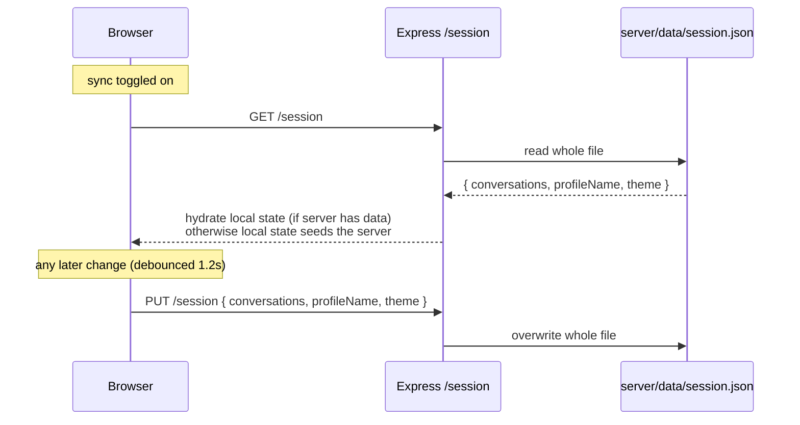

# Storage and sync

Conversations, profile name, and theme live in `localStorage` and work fully offline with no
backend running. Enabling "Sauvegarder sur le serveur" opts into syncing that same data to a
single JSON blob on the Express server, debounced by 1.2s ([ADR-0001](./adr/0001-local-first-storage-with-opt-in-sync.md),
[ADR-0002](./adr/0002-file-based-json-session-store.md)).

There's a single implicit profile with no authentication ([ADR-0003](./adr/0003-no-authentication-single-implicit-profile.md)) —
this is a trusted-network, single-user tool, not a multi-tenant service.

Regression-tested end-to-end (real file writes, a fresh GET/PUT round-trip, and a corrupted
session file producing a clean 500 instead of a crash) in `server/index.e2e.test.js` — see
[ADR-0017](./adr/0017-e2e-tests-for-the-express-proxy-server.md).
