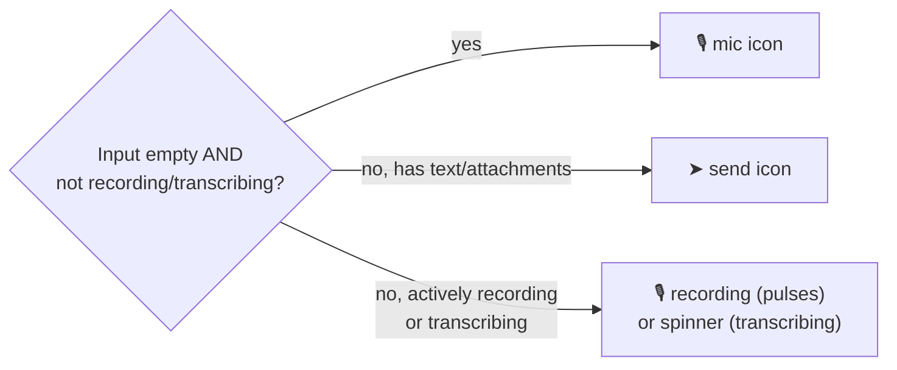
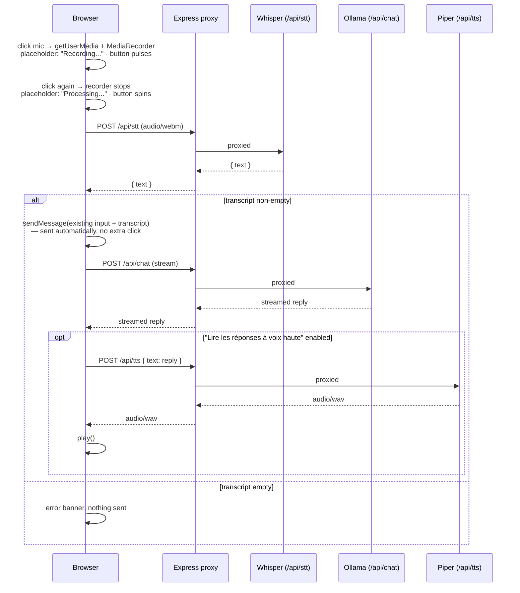

# Vocal mode

A header `<select>` switches `chatMode` between `text` and `vocal` (a third value, `claude`,
selects [Claude mode](./claude-mode.md) instead — orthogonal to this page). This mode is persisted in
`localStorage`). In `vocal` mode the input's send-button slot doubles as the mic button
([ADR-0011](./adr/0011-server-side-stt-tts-whisper-piper.md) for why STT/TTS run server-side
via Whisper/Piper rather than the browser's Web Speech API,
[ADR-0012](./adr/0012-self-signed-tls-for-secure-context.md) for why both access paths need
TLS just for `getUserMedia` to be exposed at all):

Recording/transcribing always wins the icon slot even if text appears in the input meanwhile
(e.g. the user typed something before or during dictation) — otherwise the only control that
can stop an in-progress recording would disappear mid-flow.

All three `P->>{W,O,Pi}` hops actually go through `homelab-gateway` in production
([ADR-0014](./adr/0014-route-production-traffic-through-homelab-gateway.md)), which sniffs
each request's content-type/body shape to pick the right backend — simplified out of this
diagram for the same reason as the chat flow in [`chat-and-images.md`](./chat-and-images.md).

A few details that aren't obvious from the code alone:

- **Auto-send, not auto-fill** — dictation used to just populate the input and leave sending
  to the user; it now calls the same `sendMessage()` the Send button uses, combining any text
  already typed with the new transcript. `sendMessage()` was factored out of `handleSend()`
  specifically so both entry points share one path.
- **No silent failures** — an empty Whisper transcript, a `/api/stt` or `/api/tts` error, and
  the (now fixed) audio-unlock issue below all used to fail invisibly at some point during
  development; each now surfaces as an error banner rather than doing nothing.
- **Per-message 🔊 button** — independent of vocal mode, replays any message's text through
  the same `/api/tts` proxy on demand, via a shared `speakText()` helper also used by the
  auto-play path.
- **"Lire les réponses à voix haute" setting** (`autoReadReplies`, on by default, in the
  profile menu) — gates only the *automatic* playback after a reply finishes streaming in
  vocal mode; the manual 🔊 button always works regardless of this setting.
- **Audio unlock** ([ADR-0013](./adr/0013-audio-unlock-for-autoplay-policy.md)) — the gap
  between the click that starts a send/dictation and the eventual `audio.play()` call (after
  the STT/chat/TTS round-trip) is long enough that browsers' autoplay policy rejects
  playback outright unless the shared `<audio>` element was primed with a silent clip
  synchronously inside the click handler first.
